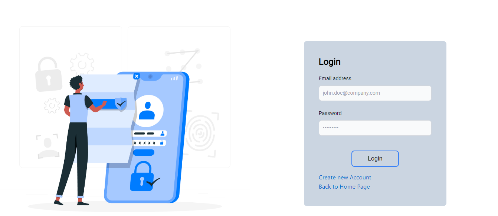

# 📝 Fellow Post (Medium Clone)


Welcome to **Fellow Post**, a sophisticated web application built with the MERN stack that replicates the core features of Medium. This project focuses on a responsive UI, secure authentication, and efficient data management.

## 🚀 Project Overview

Fellow Post(Medium Clone) is crafted to deliver a modern, engaging platform for users to write, read, and interact with articles. Key highlights include a user-friendly interface, high responsiveness, and robust backend capabilities.

## 🌟 Features

- **🎨 Responsive Design**: Crafted with **React.js** and styled using **Tailwind CSS** for a sleek, mobile-first experience.
- **Multiple UI Libraries**: Enhancing the user interface with a mix of advanced libraries for a seamless and interactive design.
- **🔍 Search & Filter**: Quickly find posts by title, author, or topic with intuitive search and filter options.
- **🔐 JWT Authentication**: Secure your data with robust **JWT** authentication and **RESTful APIs**.
- **🌐 RESTful API**: Well-defined REST API endpoints facilitating smooth interaction between frontend and backend.
- **🖼️ Image Uploads**: Upload beautiful images for your posts using **Multer**.
- **Rich Content**: Share your thoughts on a variety of topics – Tech, Education, Sports, Travel, Business, Art, Hobby, and more!
- **Favorites**: Bookmark your favorite blogs for easy access anytime.
- **Liked Blogs**: User can like their favorite blogs.
- **Share Blogs** : User can share any blogs / Posts through watsapp , facebook or mail.
- **Live Database**: This app is connected to a live database, ensuring that all content is updated in real-time.

## 🎨 UI/UX Highlights

- **User-Centric Design**: A user-friendly interface designed to enhance readability and ease of navigation.
- **Dark Mode**: Toggle between light and dark modes for an optimal reading experience in any lighting condition.
- **Responsive Layout**: Fully responsive layouts that adapt perfectly to all screen sizes and devices.
- **Interactive Elements**: Smooth animations and transitions that create an engaging user experience.

## 🛠️ Technologies Used

### Frontend:

- **React.js**: Component-based architecture for a dynamic UI.
- **Tailwind CSS**: Utility-first CSS framework for rapid UI development.
- **UI Libraries**: Incorporating libraries like **React Icons**, **Material UI**, and more for enhanced design.

### Backend:

- **Node.js & Express.js**: Powerful server-side framework for building RESTful APIs.
- **JWT Authentication**: Secure authentication to protect user data.
- **Multer**: Middleware for handling multipart/form-data, used for image uploads.
- **MongoDB**: NoSQL database for efficient data storage and retrieval.

### 💻 Usage

- **Read Blogs**: Browse through a variety of blogs across multiple categories like Tech, Education, Sports, Travel, Business, Art, Hobby, and more.
- **Post Blogs**: Share your thoughts by creating and publishing your own blogs on any topic.
- **Like Blogs**: Engage with the content by liking your favorite blogs.
- **Share Blogs**: Share interesting blogs with others via social media or direct links.
- **Favorite Blogs**: Save your favorite blogs to easily revisit them later.
- **Live Updates**: Experience real-time content updates thanks to the live database integration.

## 🛡️ Security

- **JWT Authentication**: Ensuring secure access to user accounts and content.
- **Password Hashing**: Storing passwords securely using hashing techniques.

## 🚀 Getting Started

### Prerequisites

- **Node.js** installed on your machine.
- **MongoDB** set up and running.

### Installation

1. **Clone the repository**:

   ```bash
   git clone https://github.com/yourusername/fellow-post.git
   cd fellow-post
   ```

2. **Install dependencies** for both frontend and backend:

   ```bash
   cd client
   npm install
   cd server
   npm install
   ```

3. **Set up environment variables**:

   - Create a `.env` file in the backend directory.
   - Add your MongoDB URI, JWT secret, and other necessary environment variables.

4. **Run the application**:

   - Start the backend server:
     ```bash
     npm run dev
     ```
   - Start the frontend server:
     ```bash
     cd ../frontend
     npm start
     ```

5. **Open the app** in your browser:
   ```bash
   [http://localhost:5173/]
   ```

## 🖼️ Screenshots

Login Page

SignUp Page

Home Page

Display Page

Profile Page

CreateBlog Page

Blog Page


Saved / Favorite Blog Page


## 🤝 Contributing

Contributions are what make the open-source community such an amazing place to learn, inspire, and create. Any contributions you make are **greatly appreciated**.

1. Fork the Project.
2. Create your Feature Branch (`git checkout -b feature/AmazingFeature`).
3. Commit your Changes (`git commit -m 'Add some AmazingFeature'`).
4. Push to the Branch (`git push origin feature/AmazingFeature`).
5. Open a Pull Request.

## 🙌 Acknowledgements

- [React.js](https://reactjs.org/)
- [Tailwind CSS](https://tailwindcss.com/)
- [Node.js](https://nodejs.org/)
- [Express.js](https://expressjs.com/)
- [MongoDB](https://www.mongodb.com/)
- [Multer](https://www.npmjs.com/package/multer)
